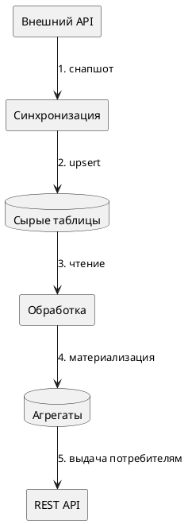

# Создание технического задания

Скилл описывает, как готовить ТЗ на реализацию функциональности: сбор вводных, структура документа, правила оформления диаграмм (PlantUML) и схемы БД (DBML → DDL).

## Процесс

1. **Собрать вводные.** Изучить код затрагиваемых модулей, существующие интеграции, спеки внешних систем и предыдущие обсуждения. Если фактическое поведение внешнего API расходится с его документацией — зафиксировать расхождение явно и опираться на фактическое поведение.
2. **Определить зависимости.** Разделить на внешние (другие команды/системы) и внутренние; пометить блокирующие. Внешние зависимости, без которых часть функциональности бездействует, не блокируют документ — указать, что именно они активируют.
3. **Заполнить шаблон.** Скелет документа — [TEMPLATE.md](TEMPLATE.md). Результат сохранять в `docs/tz-<slug>.md` проекта. Существующие документы не перезаписывать без запроса.
4. **Проверить по чек-листу** (в конце этого файла).

## Правила оформления

- Официально-деловой стиль. Каждое требование — проверяемое и однозначное.
- Бизнес-требования нумеровать (`BR-1`, `BR-2`, ...) с обоснованием: ссылка на пункт нормативного документа, спеки источника или принятую в системе модель.
- Критерии приёмки user stories — измеримые условия, привязанные к конкретным ручкам/полям/поведению.
- Неизвестные на момент написания поля (Jira, согласующие) — плейсхолдер «*(заполнить)*», не выдумывать.
- Неоднозначности данных источника оформлять как «Известные проблемы и ограничения»: формулировка проблемы + предлагаемый подход к разрешению.
- Алгоритмы описывать пошагово: условие и результат каждого шага, логика статусов, логика выбытия (soft-delete, сохранение истории), разбор конкретных кейсов таблицей «Кейс → Решение».

## Диаграммы: PlantUML

Компоненты и потоки данных рисовать в PlantUML (блок ` ```plantuml `). Для общей схемы процесса — компонентная диаграмма с нумерованными потоками; для сложных взаимодействий — диаграмма последовательности.



Номера шагов на стрелках расшифровывать списком под диаграммой.

## БД: DBML → DDL

Порядок обязателен: сначала DBML-схема, затем DDL, сгенерированный из неё, затем текстовое описание сущностей.

**DBML.** Перечисления через `Enum`, семантика полей через `note`, связи через `ref`. Логические связи с таблицами вне схемы (без физического FK) описывать в note и объяснять решение текстом.

**Генерация DDL (PostgreSQL).** Правила соответствия:

| DBML | DDL |
|---|---|
| `bigint [pk, increment]` | `BIGSERIAL PRIMARY KEY` |
| `Enum имя { ... }` | `CREATE TYPE имя AS ENUM (...)` перед таблицами |
| `[not null, default: 'x']` | `NOT NULL DEFAULT 'x'` |
| `[default: `now()`]` | `DEFAULT NOW()` |
| `[unique]` / составные `indexes` | `CONSTRAINT uq_... UNIQUE` / `CREATE INDEX ix_...` |
| `ref: > table.col` | `REFERENCES table (col)` |

Ограничения, невыразимые в DBML (частичные индексы, CHECK), помечать в DBML через `note` и реализовывать в DDL с комментарием, какой инвариант они обеспечивают.

**Описание сущностей.** Для каждой таблицы: назначение, ключевые поля и их роль, логика обработки — особенно soft-delete (что означает переход в исторический статус, какие поля фиксируют момент, как ведёт себя повторное появление записи).

## Чек-лист перед сдачей

- [ ] Все 6 разделов шаблона заполнены; незаполнимые поля — плейсхолдеры
- [ ] Каждое BR проверяемо и имеет обоснование
- [ ] У каждой user story есть измеримые критерии приёмки
- [ ] Схема процесса — PlantUML, шаги пронумерованы и расшифрованы
- [ ] Алгоритмы пошаговые, есть «Известные проблемы» и таблица кейсов
- [ ] Для API указано: метод, путь, назначение, ключевые атрибуты, использование данных
- [ ] DDL согласован с DBML (типы, enum'ы, индексы, дефолты)
- [ ] Soft-delete и сохранение истории описаны для каждой сущности, где применимо
